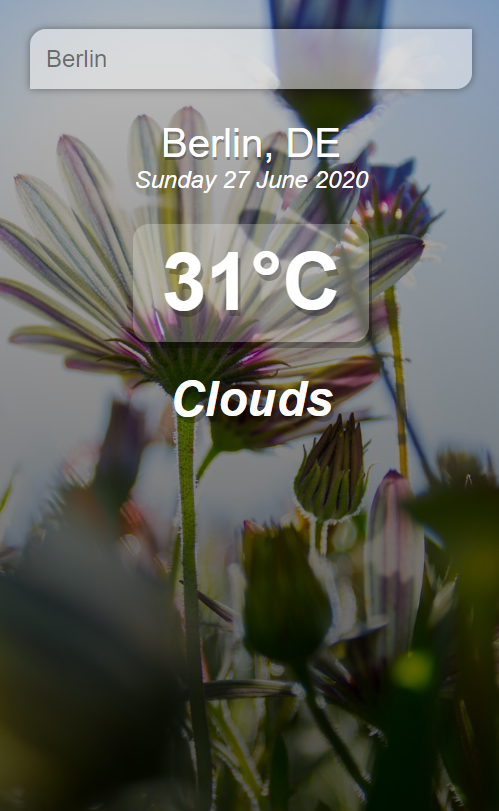
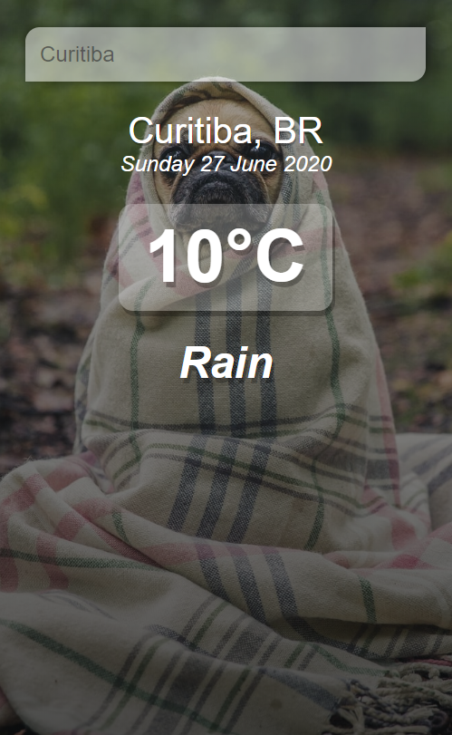
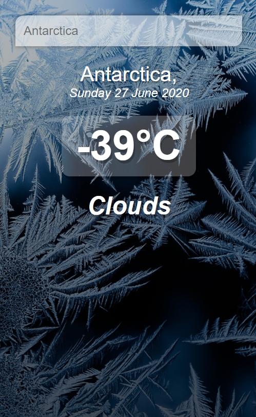

# weather-vue

A weather app build with Vue, it show the date, temperature and weather status (rain, clouds, etc.)
The application uses [Openweathermap](https://openweathermap.org/) APIs
The background changes depending on the temperature of the searched location.

## Images






## Project setup
```
npm install
```

### Compiles and hot-reloads for development
```
npm run serve
```

### Compiles and minifies for production
```
npm run build
```

### Lints and fixes files
```
npm run lint
```

### Customize configuration
See [Configuration Reference](https://cli.vuejs.org/config/).
